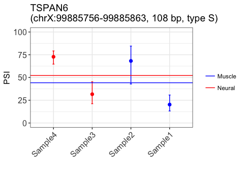
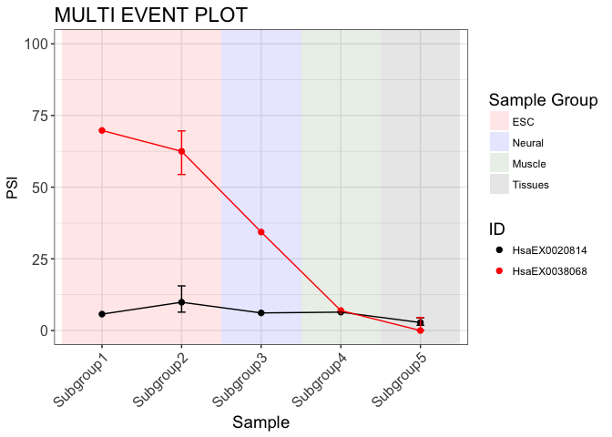

<!-- README.md is generated from README.Rmd. Please edit that file -->
[](https://travis-ci.org/kcha/psiplot)
[](https://github.com/kcha/psiplot)
[](https://github.com/kcha/psiplot/blob/master/LICENSE)

psiplot
=======

psiplot is an R package for generating plots of percent spliced-in (PSI)
values of alternatively-spliced exons that were computed by
[vast-tools](https://github.com/vastgroup/vast-tools), an RNA-Seq
pipeline for alternative splicing analysis. The plots are generated
using `ggplot2`.

For a demo of psiplot, take a look at the companion Shiny app:
<http://kcha.shinyapps.io/psiplotter-app>.

Installation
------------

See [Releases](https://github.com/kcha/psiplot/releases) for the latest
stable release or get the most up-to-date development version via
devtools:

``` r
if (!require("devtools")) install.packages("devtools")
devtools::install_github("kcha/psiplot")
```

Getting started
---------------

### Quick start

psiplot takes as input the PSI and/or cRPKM results generated by
vast-tools (e.g. after running `vast-tools combine` or
`vast-tools diff`). For example:

``` r
psi <- read.table("INCLUSION_LEVELS_FULL-Mmu53.tab", header = TRUE, sep = "\t",
                  stringsAsFactors = FALSE)
```

To plot a single splicing event, use the command `plot_event`. In this
example, we use the provided sample dataset `psi` and optional sample
[configuration](https://htmlpreview.github.io/?https://github.com/kcha/psiplot/blob/master/vignettes/psiplot-usage.html#customizing-plots)
table `config`:

``` r
library(psiplot)
# Plot an event using provided sample dataset
plot_event(psi[1,], config=config)
```



Several events can be plotted together with the function
`plot_multievent()`. This allows users to compare the inclusion patterns
of small groups of events:

``` r
plot_multievent(psi[c(1,2),], config = config, event_col = c("black", "red"))
```



### Vignette

See this
[vignette](https://htmlpreview.github.io/?https://github.com/kcha/psiplot/blob/master/vignettes/psiplot-usage.html)
for more detailed usage, including how to customize psiplots using a
configuration file. The vignette is also available in R using the
command `vignette("psiplot-usage")`.

Issues
------

Please report all bugs and issues using the [issue
tracker](https://github.com/kcha/psiplot/issues).

Related Projects
----------------

-   [vast-tools](https://github.com/vastgroup/vast-tools)
-   [VastDB](http://vastdb.crg.eu): A database with PSI values computed
    with vast-tools in many tissues and cell types of several species.
-   [psiplotter-app](https://github.com/kcha/psiplotter-app): A
    companion Shiny app for visualizing PSI plots based on this package

Acknowledgements
----------------

-   Manuel Irimia
-   Nuno Barbosa-Morais
-   Tim Sterne-Weiler

Citation
--------

Tapial, J., Ha, K.C.H., Sterne-Weiler, T., Gohr, A., Braunschweig, U.,
Hermoso-Pulido, A., Quesnel-Vallières, M., Permanyer, J., Sodaei, R.,
Marquez, Y., Cozzuto, L., Wang, X., Gómez-Velázquez, M., Rayon, T.,
Manzanares, M., Ponomarenko, J., Blencowe, B.J., Irimia, M. (2017). An
Alternative Splicing Atlas Reveals New Regulatory Programs and Genes
Simultaneously Expressing Multiple Major Isoforms in Vertebrates. Genome
Res, 27(10):1759-1768. PMID:
[28855263](https://www.ncbi.nlm.nih.gov/pubmed/28855263)
