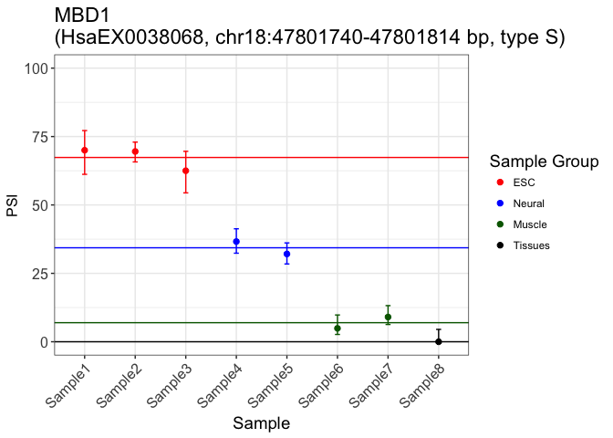
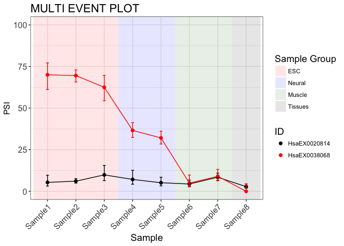

<!-- README.md is generated from README.Rmd. Please edit that file -->
[](https://travis-ci.org/kcha/psiplot)

psiplot
=======

psiplot is an R package for generating plots of percent spliced-in (PSI) values of alternatively-spliced exons that were computed by [VAST-TOOLS](https://github.com/vastgroup/vast-tools), an RNA-Seq pipeline for alternative splicing analysis. The plots are generated using `ggplot2`.

For a demo of psiplot, take a look at the companion Shiny app: <http://kcha.shinyapps.io/psiplotter-app>.

Installation
------------

See [Releases](https://github.com/kcha/psiplot/releases) for the latest stable release or get the most up-to-date development version via devtools:

``` r
if (!require("devtools")) install.packages("devtools")
devtools::install_github("kcha/psiplot")
```

Usage
-----

### Input

psiplot takes as input the PSI and/or cRPKM results generated by VAST-TOOLS (e.g. after running `vast-tools combine` or `vast-tools diff`). For example,

``` r
psi <- read.table("INCLUSION_LEVELS_FULL-Mmu53.tab", header = TRUE, sep = "\t",
                  stringsAsFactors = FALSE)
crpkm <- read.table("cRPKM-Mmu53.tab", header = TRUE, sep = "\t",
                    stringsAsFactors = FALSE)
```

This README uses the provided sample datasets, `psi`, `crpkm` and `crpkm_counts`, as example input data.

### Plotting

Events can be plotted individually as a scatterplot (a.k.a "psiplots") or collectively as a heatmap. A function to produce psiplots for multiple events is also provided.

#### Individual events

The function `plot_event()` generates a plot of a single event:

``` r
library(psiplot)

# Plot an event using provided sample dataset
plot_event(psi[1,], config = config)
```



Alternatively, to plot an event by gene name (for example, MTA1):

``` r
plot_event(psi[psi$GENE == "MTA1",], config = config)
```

<br />

#### Multi-event PSI plots

Several events can be plotted together with the function `plot_multievent()`. This allows users to compare the inclusion patterns of small groups of events:

``` r
plot_multievent(psi[c(1,2),], config = config, event_col = c("black", "red"))
```



#### Plotting gene expression values

In addition, cRPKM expression values generated by vast-tools can also be plotted in a similar manner using the function `plot_expr()`:

``` r
plot_expr(crpkm[1,], config = config)
```


#### Plotting heatmaps

The function `plot_multi` generates a heatmap of multiple events using `geom_tile`. Alternatively, if you have the R package `pheatmap` or `gplots` installed, you can set `usepkgs = 'pheatmap'` or `usepkgs = 'gplots'` to generate a heatmap. By default, rows and columns will be ordered by hierarchical clustering. One benefit of using `pheatmap` or `gplots` is the ability to include group annotations from the config file:

``` r
# example using pheatmap
plot_multi(psi, config=config, usepkg = 'pheatmap')
#> plot_multi() is under active development. Please report bugs or feedback to https://github.com/kcha/psiplot/issues.
```


Other use cases:

``` r
# For cRPKM, use expr = TRUE
plot_multi(crpkm, expr = TRUE)

# To disable clustering of events
plot_multi(psi, cluster_rows = FALSE)

# To disable clustering of samples
plot_multi(psi, cluster_cols = FALSE)

# To generate a pheatmap-based heatmap 
plot_multi(psi, usepkg = "pheatmap")
```

### Customizing plots

There are two ways to customize the plots: using a configuration file or using R arguments.

#### The `.config` file way

In `vast-tools plot`, an optional config file can be used to customize the plots' visual appearance. The same config file can be supplied here as well.

``` r
plot_event(psi[1,], config = "/path/to/config")

# config can also be pre-loaded into a data frame
cfg <- read.table("/path/to/config", header = TRUE, sep = "\t", stringsAsFactor = FALSE)
plot_event(psi[1,], config = cfg)
plot_multi(psi, config = cfg)
plot_expr(crpkm[1,], config = cfg)
```

The color and ordering of samples can be customized by supplying a plot configuration file. This file is tab-delimited and must be manually created. For example:

``` r
# sample config data
config
#> # A tibble: 8 x 5
#>   Order SampleName SubgroupName GroupName RColorCode
#>   <int> <chr>      <chr>        <chr>     <chr>     
#> 1     8 Sample8    Subgroup5    Tissues   black     
#> 2     1 Sample1    Subgroup1    ESC       red       
#> 3     2 Sample2    Subgroup1    ESC       red       
#> 4     3 Sample3    Subgroup2    ESC       red       
#> 5     4 Sample4    Subgroup3    Neural    blue      
#> 6     5 Sample5    Subgroup3    Neural    blue      
#> 7     6 Sample6    Subgroup4    Muscle    darkgreen 
#> 8     7 Sample7    Subgroup4    Muscle    darkgreen
```

-   **Order**: The ordering of the samples from left to right.
-   **SampleName**: Name of the sample. MUST match sample name in input table.
-   **SubgroupName** (Optional): Subgroup name. Use for plotting the average PSI of samples belonging to the same subgroup INSTEAD of the individual samples (enable by setting `subg=TRUE`). See [Subgrouping samples](#subgrouping-samples) for more details.
-   **GroupName**: Group name. Use for plotting the average PSI of samples belonging to the same group (enable by setting `groupmean=TRUE`).
-   **RColorCode**: An R color specification:
    1.  color name (as specified by `colors()`).
    2.  hex color code (\#rrggbb).

Tips:

-   The samples under SampleName MUST MATCH the names in the input table. Only the samples listed in the config file will be represented in the resulting plots. Other samples in the input table but not in the config file will be ignored. This may be useful for plotting only a subset of samples.
-   The column **Order** does not need to be in sorted order. Thus, you can change the ordering of your samples by simply changing the order number.
-   For `plot_multi`, specifying a config file will disable clustering of samples and instead use the config order.
-   If the config file does not include subgroups, samples will not be subgrouped, even if `subg` is set to `TRUE`. Similarly, if the config file includes subgroups, but `subg` is set to `FALSE`, they will not be used.
-   When a sample is mapped to multiple subgroups, it will only be included in the first one.
-   When a subgroup is mapped to multiple groups, it will only be included in the first one.
-   When a group is assigned to multiple colors, only the first color will be used.

#### The R way

The colors and other graphical parameters can also be configured in R via arguments. `plot_events()` and `plot_expr()` provides a limited set of arguments and can be used in conjunction with a config file. See `?plot_events` and `?plot_expr` for more details on the available options.

For example, the following command uses the configuration settings, sets the point symbol, and restricts the y-axis to (20, 80):

``` r
plot_event(psi[1,], config = config, pch = 9, ylim = c(20, 80))
```

Because the `plot_*` methods return ggplot2 objects, you can further customize the plots by appending additional aesthetics or themes (if the option is not supported within the method itself). Certain options may interfere or overwite those already set within the `plot_*` methods, so please use at your discretion. For example, to increase the text size of the legend:

``` r
plot_event(psi[1,], config = config) + theme(legend.text = element_text(size = 20))
```

### Options available for all plotting functions

#### Filtering samples by quality score

The `qual` argument can be used to indicate the minimum value of the first vast-tools quality score that a PSI value needs to have in order to be accepted. PSI values with lower quality scores will be coerced to NA.

The possible values for this score are, from worse to better: `N`, `VLOW`, `LOW`, `OK`, and `SOK`. By default, the minimum quality accepted is `VLOW`. For more information on vast-tools quality scores, please see [the description of vast-tools output](https://github.com/vastgroup/vast-tools/blob/master/README.md#combine-output-format) (column 8).

#### Subgrouping samples

The `subg` argument allows pooling samples into subgroups if there is a **SubgroupName** column included in the supplied `config` file (see [Customizing plots](#customizing-plots)). The PSI of a subgroup is the mean of the PSIs of its individual samples, after filtering out the samples with quality score below the threshold indicated by `qual` (see [Filtering samples by quality score](#filtering-samples-by-quality-score)).

``` r
plot_event(psi[1,], config = config, subg = TRUE)
```


Issues
------

Please report all bugs and issues using the [issue tracker](https://github.com/kcha/psiplot/issues).

Related Projects
----------------

-   [VAST-TOOLS](https://github.com/vastgroup/vast-tools)
-   [VastDB](http://vastdb.crg.eu): A database with PSI values computed with vast-tools in many tissues and cell types of several species.
-   [psiplotter-app](https://github.com/kcha/psiplotter-app): A companion Shiny app for visualizing PSI plots based on this package

Acknowledgements
----------------

-   Manuel Irimia
-   Nuno Barbosa-Morais
-   Tim Sterne-Weiler

Citation
--------

Tapial, J., Ha, K.C.H., Sterne-Weiler, T., Gohr, A., Braunschweig, U., Hermoso-Pulido, A., Quesnel-Vallières, M., Permanyer, J., Sodaei, R., Marquez, Y., Cozzuto, L., Wang, X., Gómez-Velázquez, M., Rayon, T., Manzanares, M., Ponomarenko, J., Blencowe, B.J., Irimia, M. (2017). An Alternative Splicing Atlas Reveals New Regulatory Programs and Genes Simultaneously Expressing Multiple Major Isoforms in Vertebrates. Genome Res, 27(10):1759-1768. PMID: [28855263](https://www.ncbi.nlm.nih.gov/pubmed/28855263)
